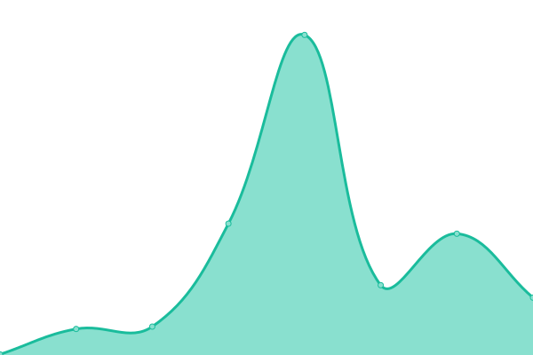

# [📈 Live Status](https://demo.upptime.js.org): <!--live status--> **🟧 Partial outage**

This repository contains the open-source uptime monitor and status page for [VALOFE](https://www.valofe.com/), powered by [Upptime](https://github.com/upptime/upptime).

With [Upptime](https://upptime.js.org), you can get your own unlimited and free uptime monitor and status page, powered entirely by a GitHub repository. We use [Issues](https://github.com/valofe/upptime/issues) as incident reports, [Actions](https://github.com/valofe/upptime/actions) as uptime monitors, and [Pages](https://demo.upptime.js.org) for the status page.

<!--start: status pages-->
<!-- This summary is generated by Upptime (https://github.com/upptime/upptime) -->
<!-- Do not edit this manually, your changes will be overwritten -->
<!-- prettier-ignore -->
| URL | Status | History | Response Time | Uptime |
| --- | ------ | ------- | ------------- | ------ |
|  [Google](https://www.google.com) | 🟩 Up | [google.yml](https://github.com/valofe/upptime/commits/HEAD/history/google.yml) | 

 114ms
     
 | 

<a href="https://https://valofe.github.io/upptime//history/google">100.00%</a>
    

|  [Wikipedia](https://en.wikipedia.org) | 🟩 Up | [wikipedia.yml](https://github.com/valofe/upptime/commits/HEAD/history/wikipedia.yml) | 

 135ms
     
 | 

<a href="https://https://valofe.github.io/upptime//history/wikipedia">100.00%</a>
    

|  [Hacker News](https://news.ycombinator.com) | 🟩 Up | [hacker-news.yml](https://github.com/valofe/upptime/commits/HEAD/history/hacker-news.yml) | 

 343ms
     
 | 

<a href="https://https://valofe.github.io/upptime//history/hacker-news">99.83%</a>
    

|  [Test Broken Site](https://thissitedoesnotexist.koj.co) | 🟥 Down | [test-broken-site.yml](https://github.com/valofe/upptime/commits/HEAD/history/test-broken-site.yml) | 

 0ms
     
 | 

<a href="https://https://valofe.github.io/upptime//history/test-broken-site">100.00%</a>
    

|  [VALOFE](https://www.valofe.com) | 🟥 Down | [valofe.yml](https://github.com/valofe/upptime/commits/HEAD/history/valofe.yml) | 

 699ms
     
 | 

<a href="https://https://valofe.github.io/upptime//history/valofe">89.25%</a>
    

|  [VFUN](https://vfun.valofe.com) | 🟥 Down | [vfun.yml](https://github.com/valofe/upptime/commits/HEAD/history/vfun.yml) | 

 611ms
     
 | 

<a href="https://https://valofe.github.io/upptime//history/vfun">72.06%</a>
    

|  [PMANG](https://www.pmang.jp) | 🟩 Up | [pmang.yml](https://github.com/valofe/upptime/commits/HEAD/history/pmang.yml) | 

 1311ms
     
 | 

<a href="https://https://valofe.github.io/upptime//history/pmang">100.00%</a>
    

|  [XIYOUXI](http://www.xiyouxi.com/) | 🟩 Up | [xiyouxi.yml](https://github.com/valofe/upptime/commits/HEAD/history/xiyouxi.yml) | 

 1033ms
     
 | 

<a href="https://https://valofe.github.io/upptime//history/xiyouxi">100.00%</a>
    

|  [QIJISOFT](http://qijisoft.com/) | 🟩 Up | [qijisoft.yml](https://github.com/valofe/upptime/commits/HEAD/history/qijisoft.yml) | 

 1090ms
     
 | 

<a href="https://https://valofe.github.io/upptime//history/qijisoft">100.00%</a>
    

<!--end: status pages-->

[**Visit our status website →**](https://demo.upptime.js.org)

## 📄 License

- Powered by: [Upptime](https://github.com/upptime/upptime)
- Code: [MIT](./LICENSE) © [VALOFE](https://www.valofe.com/)
- Data in the `./history` directory: [Open Database License](https://opendatacommons.org/licenses/odbl/1-0/)
